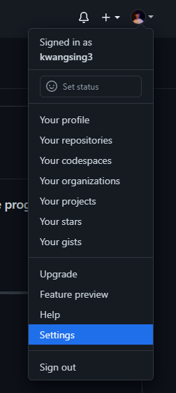
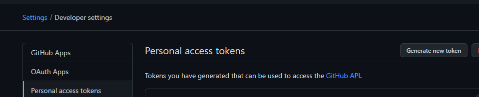
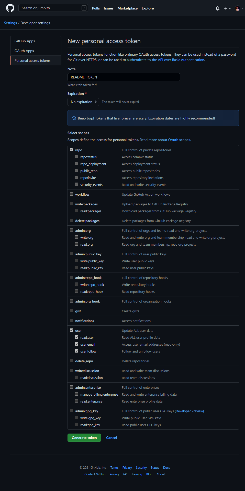

# github-profilemd-Generater

GitHub Actions 工具，透過 **GitHub GraphQL API** 自動產生個人頁面統計卡片（SVG），並 commit 回儲存庫，讓你的 Profile README 保持最新狀態。

> 多語言文件：[English](docs/README.md) ｜ [日本語](docs/README_ja.md) ｜ [繁體中文](docs/README_zh-tw.md) ｜ [简体中文](docs/README_zh-ch.md)

## 產生的卡片

每次執行會在 `output/github-profilemd-generater/<theme>/` 輸出：

| 檔案 | 說明 |
|------|------|
| `langcompos.svg` | 語言組成圓餅圖 |
| `tagsstat.svg` | 標籤 / 統計資訊卡片 |

同時產生 `output/README.md` 片段，可直接嵌入你的 Profile README。

## 可用主題

`default` ｜ `solarized` ｜ `solarized_dark` ｜ `vue` ｜ `dracula` ｜ `monokai` ｜ `nord_bright` ｜ `nord_dark` ｜ `github` ｜ `github_dark`

## GitHub Actions 快速設定

### 1. 在目標儲存庫新增 Secret

前往 **Settings → Secrets and variables → Actions** 新增：

| Secret 名稱 | 說明 |
|---|---|
| `MY_GITHUB_TOKEN` | 具備 `read:user` 與 `repo` 權限的 Personal Access Token |

<details>
<summary>📷 如何建立 Personal Access Token（圖解步驟）</summary>

| 步驟 | 操作 | 畫面 |
|:---:|------|------|
| 1 | 右上頭像選單 → **Settings** |  |
| 2 | **Developer settings → Personal access tokens** → 點 **Generate new token** |  |
| 3 | 勾選 `repo` 與 `read:user` scopes，產生後複製 token 貼到上方 Secret |  |

</details>

### 2. 新增 Workflow 檔案

```yaml
# .github/workflows/generate-profile.yml
name: Generate profile cards
on:
  workflow_dispatch:
  schedule:
    - cron: '0 0 * * 1'   # 每週一自動執行

jobs:
  build:
    runs-on: ubuntu-latest
    steps:
      - uses: actions/checkout@v4
      - uses: kwangsing3/github-profilemd-Generater@release
        env:
          GITHUB_TOKEN: ${{ secrets.MY_GITHUB_TOKEN }}
        with:
          USERNAME: ${{ github.repository_owner }}
          GITHUB_REPO_NAME: ${{ github.event.repository.name }}
```

### 3. 將卡片嵌入 Profile README

```markdown
[](https://github.com/kwangsing3/github-profilemd-Generater)
[](https://github.com/kwangsing3/github-profilemd-Generater)
```

## 本地執行

```bash
npm install
npx ncc build src/index.js -o dist
node dist/index.js <username> <repo_name> <github_token>
```

產生結果寫入 `output/` 目錄。

## 授權

MIT